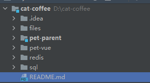
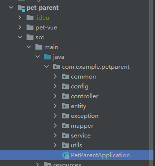
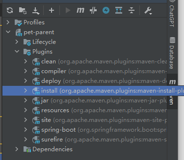
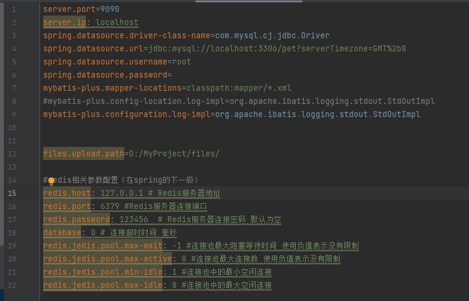
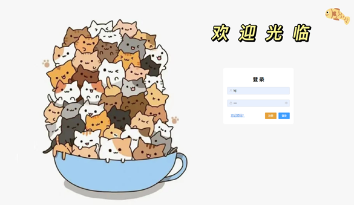
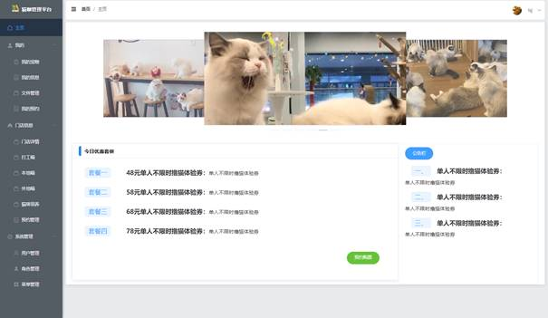
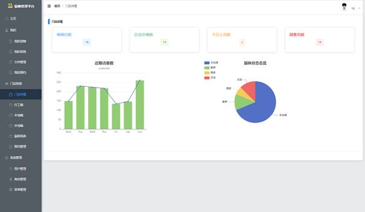
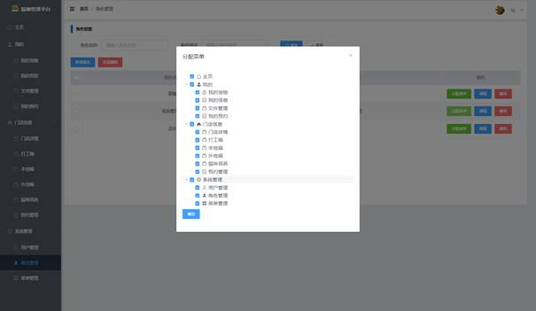
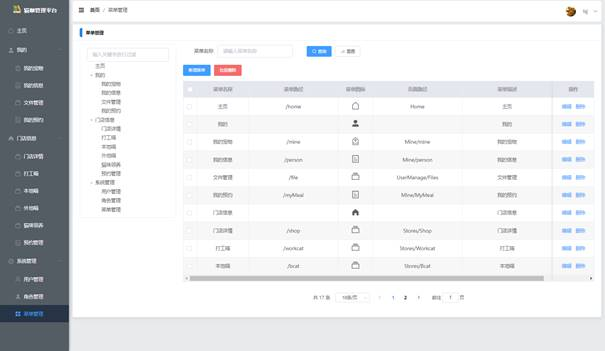

# Cat-coffee
猫咖宠物信息管理系统（前端代码（可帮部署）+qq:1225988200）

本项目为spring boot单项目

配置了redis

前端vue2+axios    集成了element-ui组件库
后端：springboot+mybatisplus   

数据库：mysql

以下为大致项目目录结构

files:存储系统使用过程中上传的文件和头像
pet-parent:后端服务，以下类为启动类，默认端口：localhost:9090

pet-vue：前端页面，对应的配置方法在该目录的readme中
redis:配置的redis的简单快捷启动，此处可更换成自己的redis
sql：存储的sql脚本，包括数据库的表创建和基础数据设置，

​		导入数据后，默认管理员登录为：用户名：lsj   密码：123

## 启动项目：

该项目采用maven配置，需要先配置好maven，并设置jdk1.8

配置完成时候点击install即可安装所需依赖，不爆红即为安装成功（爆红多刷新几次，或者重启开发工具，这里是idea）

1、下图为applicat.properties配置，首先启动mysql数据库，配置好数据库的用户名密码，此处为root，密码为空，根据自己实际情况配置即可

2、启动redis，可根据自己的redis配置，修改配置文件中对应的密码，如上图所示的：redis.password，此处为123456

3、寻找到PetParentApplication启动类，直接启动即可
项目的具体配置的相关参数在applicat.properties中

4、进入pet-vue目录，根据readme的步骤执行操作，启动前端页面
启动成功后进入localhost:8080即可看到如下登录页面
用户名：lsj   密码：123

登录之后即可正常使用该系统（以下为系统使用截图）

